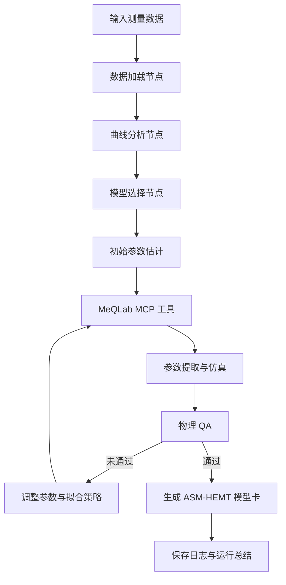

# GaN HEMT 建模 Agent

基于 LangGraph 的 GaN HEMT 紧凑模型建模 Agent 原型，面向 GaN HEMT ASM-HEMT 模型的自动化数据分析、参数提取、物理检查和模型卡生成。

本项目对应“GaN HEMT 紧凑模型建模 Agent 自动化挑战赛”。项目目标是构建一个能够调用国产大模型 API，并通过 Primarius Modeling MCP Server 对接 MeQLab 的智能建模系统。

- **赛题名称**：GaN HEMT 紧凑模型建模 Agent 自动化挑战赛
- **命题单位**：上海概伦电子股份有限公司
- **目标模型**：ASM-HEMT CMC 标准紧凑模型
- **目标工具**：概伦 MeQLab、Primarius Modeling MCP Server

> 当前版本已完成 LangGraph 主流程、四类测量数据 CSV 分析，以及国产大模型 API 的 Mock/Live 调用接口。MeQLab/MCP、真实参数拟合、ASM-HEMT 模型卡和物理 QA 尚未接入。

## 项目目标

最终系统应支持以下流程：

```text
测量数据加载
    ↓
曲线特征分析
    ↓
ASM-HEMT 模型选择
    ↓
初始参数估计
    ↓
调用 MeQLab/MCP 进行参数提取
    ↓
DC、CV、Pulse I-V、S 参数联合拟合
    ↓
物理 QA 检查
    ↓
自动调参或重新拟合
    ↓
生成模型卡、运行日志和总结
```

## 系统架构

主流程使用 LangGraph 管理状态、节点、条件分支和重试。deepagents 可作为后续的专业子 Agent 框架，用于拆分 DC、CV、Pulse I-V、S 参数和 QA 等子任务。



系统包含四类核心组件：

- **Agent 工作流**：使用 LangGraph 编排建模步骤和重试逻辑。
- **大模型决策层**：调用 DeepSeek、通义千问、智谱 GLM、Kimi 或 MiniMax 等国产大模型 API，负责曲线解释、策略建议和结果总结。
- **EDA 工具层**：通过 Primarius Modeling MCP Server 调用 MeQLab，执行参数设置、拟合、仿真和 QA。
- **数值与规则层**：使用 Python 数值工具进行数据处理，并用确定性规则检查参数物理范围和曲线质量。

## 当前功能

当前数据输入和模型决策原型包含：

- LangGraph 状态定义；
- `load_data` 数据加载节点；
- `analyze_data` 多类型测量数据特征分析节点；
- CSV 数据读取；
- DC I-V 数据点数量、最大漏极电流和栅极电压范围统计；
- C-V 电容和栅极电压范围统计；
- Pulse I-V 最大脉冲漏极电流统计；
- S 参数频率范围和 `S21` 幅值统计；
- 国产大模型 API 的统一调用封装；
- 未配置密钥时的本地 Mock 决策模式；
- 配置密钥后通过 OpenAI 兼容接口调用远程模型；
- 真实模型响应的 JSON 解析和 Token 使用量记录；
- API 密钥缺失时的明确错误提示。

当前演示数据位于：

```text
data/
├── demo_dc_iv.csv
├── demo_cv.csv
├── demo_pulse_iv.csv
└── demo_s_params.csv
```

DC I-V 数据格式如下：

```csv
Vgs,Vds,Ids
-4,5,0
-3,5,0.001
-2,5,0.015
-1,5,0.12
0,5,0.35
1,5,0.62
2,5,0.85
```

其他演示数据采用以下列名：

```text
C-V:       Vg,Cgg
Pulse I-V: Vgs,Vds,Ids_pulse
S 参数:    Frequency,S11_real,S11_imag,S21_real,S21_imag
```

其中电压单位为 V，漏极电流单位建议使用 A，电容单位由数据文件自行约定，频率单位建议使用 Hz。

## 环境要求

- Python 3.10 或更高版本；
- Windows、Linux 或 macOS；
- 能够访问所使用的大模型 API；
- 比赛运行阶段需要能够访问 MeQLab 服务端点和 Primarius Modeling MCP Server。

## 安装

在项目根目录执行：

```powershell
python --version
python -m venv .venv
.\.venv\Scripts\Activate.ps1
python -m pip install -U pip
python -m pip install -r requirements.txt
```

如果 PowerShell 提示禁止运行脚本，可以仅对当前终端临时放行：

```powershell
Set-ExecutionPolicy -Scope Process -ExecutionPolicy Bypass
.\.venv\Scripts\Activate.ps1
```

确认命令行前面出现 `(.venv)` 后，再执行安装命令。

## 运行最小原型

```powershell
python main.py
```

默认情况下，程序使用 Mock 模式，不需要 API 密钥。若要启用真实大模型，先将 `.env.example` 复制为项目根目录下的 `.env`，然后只在 `.env` 中填写配置：

```text
LLM_ENABLED=true
LLM_API_KEY=你的模型服务密钥
LLM_BASE_URL=https://api.deepseek.com
LLM_MODEL=deepseek-v4-flash
```

不要把真实密钥填写到 `.env.example`、代码文件或 README 中。`.env` 已被加入 `.gitignore`，不要将真实密钥提交到 GitHub。`LLM_BASE_URL` 和 `LLM_MODEL` 可以替换为其他比赛允许的国产大模型服务配置。

预期输出：

```text
Agent 运行结果：
dc_iv: {'data_type': 'DC I-V', 'point_count': 7, 'max_Ids': 0.85, 'min_Vgs': -4.0, 'max_Vgs': 2.0}
cv: {'data_type': 'C-V', 'point_count': 7, 'min_Cgg': 4.2e-07, 'max_Cgg': 1.05e-06, 'min_Vg': -4.0, 'max_Vg': 2.0}
pulse_iv: {'data_type': 'Pulse I-V', 'point_count': 5, 'max_Ids_pulse': 0.88}
s_params: {'data_type': 'S 参数', 'point_count': 4, 'min_frequency': 1000000000.0, 'max_frequency': 4000000000.0, 'max_S21_magnitude': 2.1213203435596424}
大模型状态: mock
建模建议: {'next_step': '先进行 DC I-V 参数提取，再用 C-V 和 Pulse I-V 校准模型', 'reason': '当前未启用真实大模型 API，使用本地演示建议', 'parameters_to_check': ['Vth', 'Ids', 'Cgg', '自热和陷阱参数']}
```

启用真实模型后，`大模型状态` 应为 `live`。程序不会下载模型到本地，而是通过配置的 API 地址远程调用模型服务。

## 目录结构

当前目录结构：

```text
.
├── main.py
├── llm_client.py
├── requirements.txt
├── .env.example
├── .gitignore
├── data/
│   ├── demo_dc_iv.csv
│   ├── demo_cv.csv
│   ├── demo_pulse_iv.csv
│   └── demo_s_params.csv
├── problem3_gan_hemt_agent.pdf
└── README.md
```

计划中的完整目录结构：

```text
.
├── agent/
│   ├── graph.py              # LangGraph 工作流
│   ├── state.py              # Agent 状态定义
│   ├── nodes.py              # 工作流节点
│   ├── routing.py            # 条件路由和重试逻辑
│   └── prompts.py            # 大模型提示词
├── tools/
│   ├── mcp_client.py         # MCP 客户端
│   └── meqlab_tools.py       # MeQLab 工具封装
├── llm/
│   └── provider_client.py    # 国产大模型 API 封装
├── modeling/
│   ├── param_schema.py       # ASM-HEMT 参数定义
│   ├── fitting_strategy.py   # 分阶段拟合策略
│   ├── qa_rules.py           # 物理 QA 规则
│   └── model_card.py         # 模型卡生成
├── data/
├── outputs/
├── logs/
├── main.py
├── requirements.txt
└── README.md
```

## 目标 Agent 节点

完整版本计划包含以下节点：

1. `load_data`：加载 DC I-V、C-V、Pulse I-V 和 S 参数数据。
2. `analyze_curves`：识别数据类型、偏置范围、异常点和关键曲线特征。
3. `select_model`：选择 ASM-HEMT 模型及拟合参数分组。
4. `estimate_initial_params`：根据曲线特征生成初始参数。
5. `fit_dc`：拟合直流 I-V 和跨导特性。
6. `fit_cv`：拟合结电容和电荷相关参数。
7. `fit_pulse_iv`：拟合陷阱、自热和脉冲响应相关参数。
8. `fit_sparams`：拟合高频 S 参数。
9. `physical_qa`：检查单调性、对称性、kink、参数范围和收敛情况。
10. `retune_or_finish`：根据 QA 结果决定重新拟合或结束流程。
11. `generate_model_card`：生成完整模型卡。
12. `save_reports`：保存运行日志、调用记录和运行总结。

## 大模型使用原则

大模型用于：

- 解释测量曲线和异常现象；
- 选择下一步建模动作；
- 提出参数调整策略；
- 总结拟合和 QA 结果。

确定性程序和 MeQLab 用于：

- 实际参数计算和曲线拟合；
- 仿真运行；
- 数值指标计算；
- 物理范围检查和最终 QA。

不建议让大模型直接伪造参数提取结果。所有关键参数都应能够追溯到数据、工具调用和仿真结果。

## MCP 工具接口规划

后续将把 Primarius Modeling MCP Server 封装为统一工具接口，例如：

```text
load_dataset
select_model
set_parameter
run_fit
run_simulation
run_qa
plot_curve
export_model_card
get_session_status
```

每次 MCP 调用都应记录：

- 时间戳；
- 当前 Agent 节点；
- 工具名称；
- 输入参数摘要；
- 输出结果摘要；
- 是否成功；
- 调用耗时。

## 输出文件

完整版本每个测试器件应生成：

- 一份 ASM-HEMT 完整模型卡；
- 一份包含 MCP 调用和大模型调用统计的运行日志；
- 一份建模过程和最终结果总结。

建议输出目录如下：

```text
outputs/
├── device_1_model_card.json
├── device_2_model_card.json
└── run_summary.md

logs/
├── device_1_run.jsonl
└── device_2_run.jsonl
```

## 比赛评分关注点

根据赛题说明，主要评分形式为：

```text
Card_i_Score = QA_pass_rate × (1 − Curve_RMSE_normalized)
总分 = 0.7 × mean(Card_1, Card_2) + 0.3 × min(Card_1, Card_2)
```

因此系统需要同时关注：

- 曲线拟合误差；
- 物理 QA 通过率；
- 两个测试器件上的稳定性；
- MCP 调用记录和运行过程可审计性；
- 国产大模型 API 的真实调用情况。

## 开发路线

- [x] 创建 Python 虚拟环境。
- [x] 跑通 LangGraph 最小工作流。
- [x] 读取 DC I-V CSV 数据。
- [x] 输出基本曲线统计特征。
- [x] 增加 C-V、Pulse I-V、S 参数数据接口。
- [x] 增加国产大模型 API 兼容封装和 Mock 模式。
- [ ] 配置真实模型服务并完成 API 联调。
- [ ] 增加 MCP 客户端和 MeQLab 工具封装。
- [ ] 增加 ASM-HEMT 参数模式和参数约束。
- [ ] 增加分阶段拟合与自动重试。
- [ ] 增加物理 QA 规则。
- [ ] 生成模型卡、运行日志和运行总结。
- [ ] 使用隐藏测试流程进行端到端验证。

## 参考文档

- [LangGraph 安装文档](https://docs.langchain.com/oss/python/langgraph/install)
- [LangGraph Graph API](https://docs.langchain.com/oss/python/langgraph/use-graph-api)
- [LangGraph 持久化文档](https://docs.langchain.com/oss/python/langgraph/persistence)
- [deepagents 概览](https://docs.langchain.com/oss/python/deepagents/overview)
- [LangChain MCP 集成文档](https://docs.langchain.com/oss/python/langchain/mcp)

## 许可证

项目许可证待确定。若用于比赛最终提交，建议根据组委会要求采用 MIT 或 Apache-2.0 等友好开源许可证。
